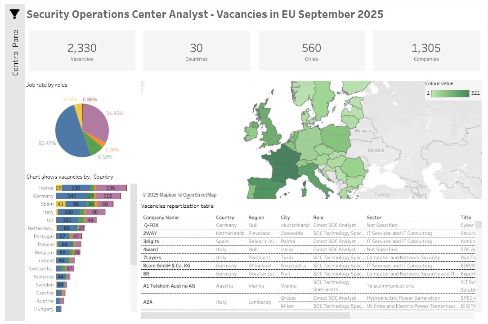

# 🛡️ SOC Analyst Job Market Analysis

### 📊 Project Overview
This project analyzes the current job market for **SOC Analysts** and **Cyber Security Specialists** in Europe. Unlike standard analyses based on pre-cleaned datasets, this project involves an **end-to-end data engineering pipeline**: scraping raw data using **Apify**, processing it with Python, and visualizing it in Tableau.

**Key Insights:**
* Most in-demand technical skills (SIEM, Python, Splunk, etc.).
* Role classification (Direct SOC vs. Engineering vs. Management).
* Geographic distribution of Cyber Security hubs in Europe.

### ⚙️ The Data Pipeline (ETL Process)

The core of this project is a robust **Python ETL pipeline** (see `Data processing process flow.ipynb`) that handles raw data ingestion, cleaning, and enrichment.

**Key Technical Steps:**
1. **Data Collection (Ingestion):** Utilized **Apify** (specifically the *LinkedIn Jobs Scraper* and *Glassdoor Jobs Scraper* actors) to gather a raw dataset of over 4,000 JSON records.
2. **Advanced Filtering:** Implements a **dual-layer relevance filter** (Title OR Description scan) to capture niche roles while excluding irrelevant listings.
3. **Deduplication:** Uses composite keys (`Title` + `Company` + `Location`) to ensure data integrity.
4. **Enrichment:**
    * **Role Classification Engine:** Maps job titles to standardized SOC roles using a priority-based keyword matching system (Rule-based logic).
    * **Skills Extraction:** Parses job descriptions using Regex to extract specific technical stacks.
    * **Geographic Parsing:** Splits raw location strings into City, Region, and Country.

### 🛠️ Technologies Used
* **Data Collection:** Apify (Web Scraping).
* **Python:** Pandas, JSON, Glob, Re (Regex).
* **Jupyter Notebook:** For interactive data processing.
* **Tableau:** For the final interactive dashboard.

### 📈 Results
The pipeline processed over **4,000 raw listings**, resulting in a clean dataset of **2,300+ unique, relevant jobs**. The classification algorithm achieved a high success rate, identifying complex roles across multiple languages (English, German, French).

---
*Created by Iurie Stratulat*
